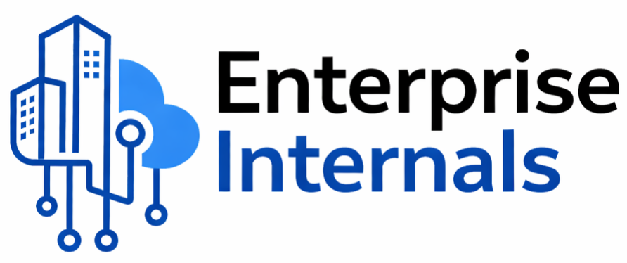

<h1>Enterprise Internals</h1>

Understanding how enterprise systems, cloud platforms, governance,
automation, AI, and technology strategy actually work in practice.

A structured knowledge platform focused on enterprise architecture,
cloud transformation, platform engineering, operational strategy,
and enterprise AI adoption.

<h2>Knowledge Domains</h2>

Structured enterprise technology domains connected through real-world architecture, operations, governance, and transformation thinking.

<h3><a href="docs/enterprise-cloud/index.html">Enterprise Cloud</a></h3>

Cloud transformation, landing zones, governance, migration, and platform strategy.

<h3><a href="docs/enterprise-ai/index.html">Enterprise AI</a></h3>

Gen-AI, RAG, enterprise AI architecture, adoption patterns, and operational AI.

<h3><a href="docs/enterprise-security/index.html">Enterprise Security</a></h3>

IAM, governance, cloud security architecture, and enterprise protection models.

<h3><a href="docs/enterprise-networking/index.html">Enterprise Networking</a></h3>

Hybrid connectivity, segmentation, enterprise-scale network architecture.

<h3><a href="docs/enterprise-observability/index.html">Enterprise Observability</a></h3>

Monitoring, telemetry, operational visibility, and platform operations.

<h3><a href="docs/enterprise-applications/index.html">Enterprise Applications</a></h3>

Application architecture, integration patterns, modernization, and scalability.

<h3><a href="docs/enterprise-business/index.html">Enterprise Business</a></h3>

Business alignment, enterprise thinking, architecture strategy, and decision models.

<h3><a href="docs/enterprise-sourcing/index.html">Enterprise Sourcing</a></h3>

RFP lifecycle, procurement models, vendor evaluation, and enterprise sourcing strategy.

<h3><a href="docs/enterprise-bcp/index.html">Enterprise BCP</a></h3>

Business continuity, resilience engineering, disaster recovery, and operational preparedness.

<h2>Built For</h2>

Designed for professionals operating across enterprise-scale architecture, cloud, AI, and transformation ecosystems.

Enterprise Architects

Cloud & AI Architects

Platform Engineers

Technology Consultants

Solution Architects

Engineering Leaders

Transformation Teams

Enterprise Technology Professionals

<h2>Featured Series</h2>

Curated enterprise transformation and architecture series designed around real-world implementation, consulting, governance, and operational execution.

<h3><a href="docs/enterprise-cloud/index.html">Enterprise Cloud Transformation</a></h3>

Cloud adoption frameworks, enterprise migration strategy, landing zones, governance, and transformation execution.

<h3><a href="docs/enterprise-ai/index.html">Enterprise AI Foundations</a></h3>

LLMs, RAG architecture, enterprise AI adoption, operational AI patterns, and Gen-AI implementation thinking.

<h3><a href="docs/enterprise-cloud/deep-dives/landing-zones.html">Azure Landing Zones</a></h3>

Enterprise-scale landing zone architecture, governance boundaries, connectivity, identity, and platform design.

<h3><a href="docs/enterprise-business/index.html">Architecture & Business Thinking</a></h3>

How enterprise architecture aligns with business priorities, sourcing, governance, operating models, and transformation strategy.

